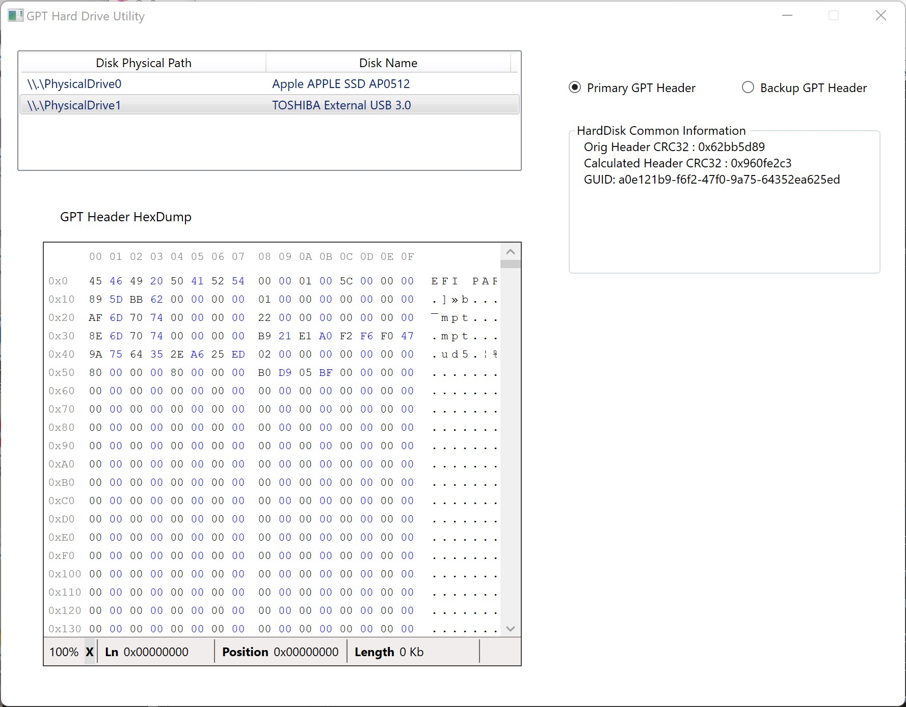

# GPT Header Information Utility

This tool is aimed for viewing the basic information of primary and backup GPT tables on each physical hard drive, as well as its original hexadecimal data. The application is still to be finished.

